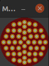

Microphone Mute Indicator
=========================

Displays the status of the Ubuntu (pulse audio) microphone and hereby mimics
an "On air" light.

<table>
    <tr>
        <td>System mic on:</td>
        <td>System mic off:</td>
    </tr>
    <tr>
        <td></td>
        <td></td>
    </tr>
</table>

Problem
------
In video conferences I usually have the microphone of the VC software switched
on and toggle mic on/ off via the Ubuntu system microphone state.

For this, I assigned the "Calculator" key (you can choose any other) to toggle: 
.  
With this setup, I can mute/ unmute myself from any application by just pressing the assigned hotkey.
I don't have to switch back to the VC software to activate it - which is really handy.

The issue now was that I didn't know in which state the system mic was. 
Was it still "on" or did I already mute myself?? So I was looking for a simple way to permanently see the status of the system mic. I thought off an
"On Air" light of recording studios but simpler + in software.

The result was this little script.

Feature
-------
- always on top
- let the background application still shine through
- requires only core Python3 (tested with 3.8)

Usage
-----

Manually run via `python3 microphone-mute-indicator.py`. Alternatively,
you can install the script as local Ubuntu application running `make install`.
You then should have an application called *Microphone Mute Indicator* available.

Once started, I usually move the application in the upper right corner of my VC screen but you are free to position it wherever it suits you best.

Command Line Option
-------------------
`--opacity` - how transparent should the application be. *0* is fully transparent, *1.0* is fully opaque. Range is between 0 - 1.0. Default is *0.6* 